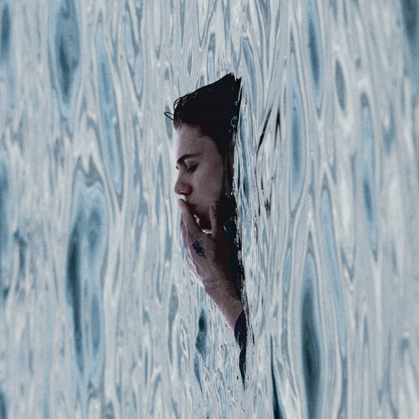

Esse é meu primeiro review! Ainda tô pegando o jeito

BEFORE I FORGET é o segundo álbum de estúdio do The Kid Laroi e teve uma recepção mista no último mês. O Laroi inclusive comentou em uma publicação no Instagram que esse álbum foi feito em apenas 4 meses, após seu término com a também cantora Tate McRae, descartando um outro projeto que vinha sendo feito há mais de um ano.

Esse álbum evidência a busca de Laroi por uma produção mais polida e interessante, que em alguns momentos acertou em cheio mas normalmente é razoável, raramente deixando a desejar (como em RATHER BE, ou em THE MOMENT que é uma das minhas faixas favoritas e teve muito de seu potencial lesado pela produção). Pode-se dizer que é uma produção genérica de pop/trap que bebe de alguns artistas como Dijon e por incrível que pareça Backstreet Boys.

Se a produção do álbum é ok, nem surpreende nem decepciona, onde mora a controvérsia que circunda esse álbum? Na temática e nas letras. 

Quando o álbum não fala sobre o término, fala sobre o passado ou os possíveis futuros. Para mim, esse é o grande acerto do projeto. Ouvi em muitos lugares que ele demonstrava toxicidade, infantilidade ou imaturidade, curiosamente nenhuma dessas resenhas fala sobre os momentos em que ele reconhece isso.

O Laroi ao longo do álbum mostra como nos sentimos em um término, a saudade, a raiva, a imaturidade, todas as coisas belas e horríveis que se sente quando aquela pessoa tão amada vai embora. Desde a dificuldade de entender que a pessoa não está mais ali à apreciação pelo que foi vivido. A vontade de culpar o outro e a consciência de que não há culpa. 

Esse álbum é do começo ao fim um relato cru e pessoal de como ele se sentiu no término, seja nos momentos racionais ou irracionais, bonitos ou feios. É um retrato muito bonito e bem feito de uma das coisas que mais machuca.

Leva 6 de 10. 

Melhores faixas - THANK GOD, MAYBE I'M WRONG, BACK WHEN YOU WERE MINE